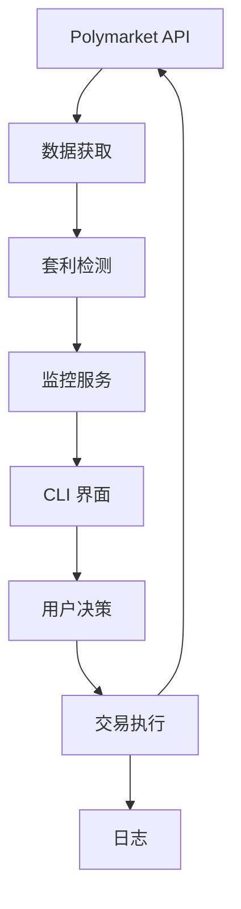

# 架构设计

## 项目结构

```
poly-sentinel/
├── src/
│   ├── cli/              # 用户界面
│   │   └── interface.ts  # 交互式 CLI 提示
│   ├── core/             # 业务逻辑
│   │   ├── arbitrage-detector.ts  # 机会检测
│   │   └── trade-executor.ts      # 交易执行
│   ├── services/         # 外部集成
│   │   ├── polymarket-api.ts      # Polymarket API 客户端
│   │   ├── monitor.ts             # 市场监控
│   │   └── notification.ts        # 提醒和通知
│   ├── utils/            # 工具函数
│   │   └── logger.ts     # 日志系统
│   ├── config/           # 配置
│   │   └── index.ts      # 环境配置
│   ├── types/            # TypeScript 类型
│   │   └── index.ts      # 类型定义
│   └── index.ts          # 主入口
├── logs/                 # 日志文件（自动生成）
└── dist/                 # 编译输出（自动生成）
```

## 核心组件

### 1. PolymarketAPI (`services/polymarket-api.ts`)

与 Polymarket API 接口交互：
- **CLOB API**：订单簿数据
- **Gamma API**：市场信息

**关键方法：**
- `getActiveMarkets()` - 获取活跃市场
- `getBestPrices()` - 获取 YES/NO 价格
- `getOrderBook()` - 获取订单深度

### 2. ArbitrageDetector (`core/arbitrage-detector.ts`)

分析市场寻找套利机会。

**算法：**
```
对于每个市场：
  1. 获取 YES 和 NO 价格
  2. 计算 总成本 = YES + NO
  3. 如果 总成本 < 1：
     - 利润 = 1 - 总成本
     - 利润率 = 利润 / 总成本
  4. 如果 利润率 >= 最小利润率：
     - 返回为机会
```

**过滤器：**
- 最小利润率
- 最小流动性
- 市场状态（活跃、未关闭）

### 3. MonitorService (`services/monitor.ts`)

协调持续的市场扫描。

**流程：**
```
启动 → 健康检查 → 轮询市场 → 检测机会
  ↑                              ↓
  └────← 等待（轮询间隔）←─── 通知
```

**功能：**
- 可配置的轮询间隔
- 机会回调系统
- 错误恢复

### 4. TradeExecutor (`core/trade-executor.ts`)

执行套利交易。

**模式：**
- **模拟运行**：模拟交易，记录结果
- **实盘**：执行真实交易（未完全实现）

**流程：**
1. 验证钱包和余额
2. 验证机会仍然有效
3. 同时执行 YES/NO 买入
4. 记录结果

### 5. CLIInterface (`cli/interface.ts`)

交互式命令行界面。

**职责：**
- 显示机会
- 提示用户决策
- 显示统计
- 格式化输出

### 6. 主应用 (`index.ts`)

协调所有组件。

**生命周期：**
```
初始化 → 启动监控 → 监听机会
            ↓
      暂停监控 → CLI 提示 → 执行交易
            ↓
      恢复监控 → 继续
```

## 数据流



## 配置

环境变量控制行为：

| 变量 | 用途 | 默认值 |
|------|------|--------|
| `DRY_RUN` | 启用模拟模式 | `true` |
| `MIN_PROFIT_MARGIN` | 最小利润阈值 | `0.02` (2%) |
| `MAX_TRADE_AMOUNT` | 每笔最大交易金额 | `100` |
| `POLL_INTERVAL_MS` | 市场扫描频率 | `10000` (10秒) |
| `MIN_LIQUIDITY` | 最小市场流动性 | `1000` |

## 套利策略

### YES/NO 套利

**原理**：在二元市场中，YES + NO 应该等于 $1。

**示例：**
- YES = $0.45
- NO = $0.50
- 总计 = $0.95

**操作**：用 $0.95 同时买入 YES 和 NO

**结果**：市场结算时，一个代币支付 $1，利润 = $0.05

**利润率**：5.26% ($0.05 / $0.95)

### 风险因素

1. **滑点**：执行前价格变化
2. **Gas 费用**：Polygon 上的交易成本
3. **市场结算**：极少数情况无赢家
4. **流动性**：有限的订单深度

### 为什么存在机会

市场低效源于：
- 不同的风险评估
- 情绪化交易
- 信息不对称
- 某些市场流动性不足

## 日志

最小日志方法（默认仅记录错误）：

- **控制台**：仅面向用户的信息
- **文件**：用于调试的详细日志
  - `combined.log`：所有事件
  - `error.log`：仅错误

开发期间设置 `LOG_LEVEL=info` 以获取详细日志。

## 未来增强

- [ ] 完整的 CLOB 订单执行
- [ ] WebSocket 实时价格
- [ ] 多市场关联套利
- [ ] Web 仪表板
- [ ] Telegram 通知
- [ ] 历史性能跟踪
- [ ] 回测系统
